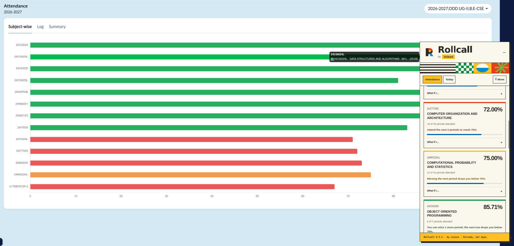
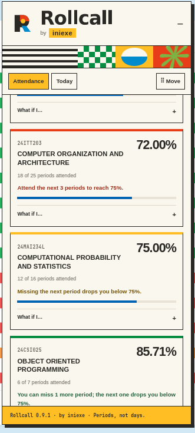
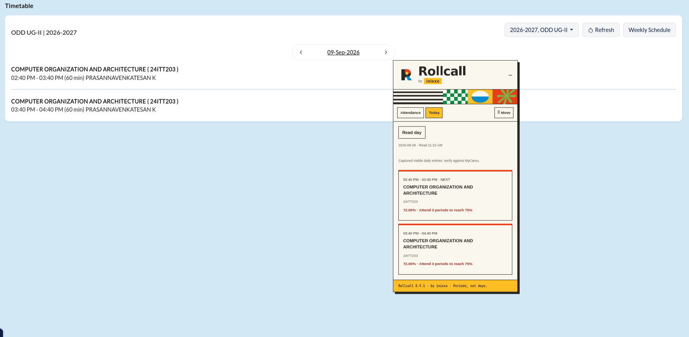

# Rollcall — by iniexe


A browser extension for checking MyCamu attendance and reading the daily timetable. Version **0.9.2** clarifies Chrome installation and introduces validated browser-only packaging.

## Features

- **Attendance:** exact attended/held counts, safe absences and recovery periods at 75%.
- Search, At risk filter and Attend next / Miss next previews.
- **Today:** read visible daily timetable entries; show ongoing/next class and match attendance by exact course code.
- Capture timestamps; attendance older than 15 minutes is not used for Today warnings.
- Drag the Move handle; double-click it or press Enter to reset position. Click the branded header to collapse.
- Original geometric logo, cream/primary-colour theme and prominent **iniexe** credit.

## Screenshots

User-provided screenshots of **Rollcall 0.9.1** running on MyCamu. These demonstrate the displayed session, not compatibility with every institution or browser.

### Attendance alongside MyCamu



### Clear course status



### Timetable with matched attendance



The timetable screenshot shows both scheduled entries for the displayed course, its 72% attendance, and the three-period recovery requirement. This is user-supplied live evidence; automated browser execution remains separately tracked below.

## Install in Chrome or Edge — select the folder

**The Load unpacked window only selects folders. It is normal for `manifest.json` to be hidden there.**

1. Download the **rollcall-v0.9.2-browser.zip** asset from the latest release.
2. Extract the ZIP with your file manager. Do not open it as an archive inside Chrome.
3. Open `chrome://extensions` (or `edge://extensions`) and enable Developer mode.
4. Click **Load unpacked**, open the extracted folder, then select **rollcall-extension** and click **Select Folder / Open**. You do not select a JSON file in Chrome.
5. Refresh MyCamu. The panel footer should say **0.9.2**.

If you downloaded GitHub's **Source code (zip)** instead, select the **extension** folder inside the extracted repository. Selecting the outer repository folder causes “Manifest file is missing or unreadable”.

| Download | Folder to select in Chrome / Edge |
| --- | --- |
| `rollcall-v0.9.2-browser.zip` | `rollcall-extension` |
| GitHub Source code ZIP / cloned repository | `extension` |
| Old project ZIP | Inner `extension` folder; prefer the latest browser ZIP |

**Firefox is different:** Load Temporary Add-on selects the `manifest.json` **file** inside that folder.

## Installation

Use a current desktop browser. No Node.js, terminal commands or account setup are needed to install Rollcall. This is an unpacked extension, not a browser-store release.

1. Download and extract the project ZIP. From a GitHub repository, use **Code → Download ZIP**, then extract it.
2. Locate the **extension** folder containing `manifest.json`. With the extension-only ZIP, this folder is named **rollcall-extension**.
3. Keep that folder somewhere permanent. Select this inner folder, not the ZIP or the outer project folder.
4. Follow the browser instructions below, then open MyCamu and refresh its page.

### Google Chrome

1. Enter `chrome://extensions` in the address bar.
2. Enable **Developer mode**.
3. Click **Load unpacked** and select the folder containing `manifest.json`.
4. Confirm Rollcall is enabled; open MyCamu → Attendance.

[Official Chrome installation guide](https://developer.chrome.com/docs/extensions/get-started/tutorial/hello-world).

### Microsoft Edge

1. Enter `edge://extensions` in the address bar.
2. Enable **Developer mode**.
3. Click **Load unpacked** and select the extension folder.
4. Refresh MyCamu.

[Official Edge sideloading guide](https://learn.microsoft.com/en-us/microsoft-edge/extensions/getting-started/extension-sideloading).

### Mozilla Firefox

1. Enter `about:debugging#/runtime/this-firefox` in the address bar.
2. Click **Load Temporary Add-on**.
3. Open the extension folder and select **manifest.json**.
4. Refresh MyCamu. The footer should show **0.9.2**.

Firefox removes temporary add-ons when the browser restarts. Repeat these steps after a restart. This project does not yet include a signed package for permanent Firefox installation. [Official Firefox temporary-installation guide](https://extensionworkshop.com/documentation/develop/temporary-installation-in-firefox/).

### Other browsers

Brave, Vivaldi and Opera are Chromium-based candidates, but Rollcall has not been verified in them. Open the browser's Extensions manager, look for **Developer mode → Load unpacked**, and select the same extension folder if those controls are available. Treat these as experimental installations, not confirmed support.

Safari has no ready-to-install package in this project. Mobile browsers and the native MyCamu app are outside this release's scope. Android source is excluded.

## How to use Rollcall

### Check attendance

1. Log into MyCamu normally and select the correct semester.
2. Open **Attendance → Subject-wise**.
3. In Rollcall, select **Attendance → Scan attendance** and wait for the scan to finish.
4. Compare the captured courses with the chart. If a course is missing, hover its bar to expose its tooltip.
5. Use **Find a course** to search by name or code. Toggle **At risk** to show courses below 75% or where the next missed period would cross below 75%.
6. Expand **What if I…** inside a card to preview attending or missing the next counted period. This never changes your actual counts.

| Card message | Meaning |
| --- | --- |
| You can miss N more periods | Those additional absences keep attendance at or above 75%; the following absence drops it below. |
| Missing the next period drops you below 75% | No absence margin remains. |
| Attend the next N periods | Attend N consecutive counted periods to recover to at least 75%. |

Calculations use **counted periods, not days**. A timetable slot's duration does not establish how many attendance periods MyCamu counts.

### Read the daily timetable

1. Scan attendance first so there are counts to match.
2. Navigate directly to **Timetable in the same tab**.
3. Choose a date in MyCamu's daily timetable; close **Weekly Schedule** if open.
4. Select Rollcall's **Today → Read day**.
5. Verify the displayed date and course list. **NOW** identifies an ongoing entry; **NEXT** identifies the next entry when the selected date is today.
6. After changing the selected day, click **Read day** again. A day other than today is explicitly labelled.

Course matches use exact course codes. If attendance is unavailable or older than 15 minutes, return to Attendance and scan again. A reload clears in-memory captures, so scan again after refreshing. No readable classes does **not** establish a holiday or free day.

### Move, collapse and reset

- Drag **Move** to reposition the panel.
- Double-click Move, or focus it and press Enter, to reset its position.
- Click the **Rollcall header** to collapse or expand it.
- Use **Attendance → Troubleshooting → Clear results** to discard captured data.
- Use **Download diagnostics** when reporting a reading problem.

### Update or uninstall

For updates, replace the files in the installed folder, reload Rollcall from your browser's extension manager, then refresh MyCamu. In Firefox, use **Reload** beside the temporary add-on. If the footer still shows an old version, remove the old installation and load the new folder. Keep only one Rollcall installation active.

To uninstall, remove Rollcall in the browser's extension manager. Refresh MyCamu to remove the already-loaded panel.

### Troubleshooting

| Problem | What to try |
| --- | --- |
| Manifest missing | Extract the ZIP first; select the inner folder containing `manifest.json`. Firefox requires selecting the file itself. |
| No panel | Confirm the extension is enabled, refresh MyCamu, and open Attendance or Timetable. The panel is limited to those pages. |
| No courses or incomplete results | Open Subject-wise, scan, then hover missing chart bars. |
| Date unavailable | Select one day in the daily timetable, close the weekly view, and click Read day again. |
| Timetable course has no attendance | Scan attendance in the same tab; verify that the course codes match. |
| Wrong account or semester data | Refresh MyCamu after switching account or semester and capture again. |
| Still failing | Include the Rollcall version, browser, diagnostics and a screenshot of the affected view in your report. |

## Evidence and honest verification status

| Check | Result | Evidence |
| --- | --- | --- |
| Calculation/parser regression tests | 13 tests passed | [Actual test output](docs/evidence/unit-tests.txt) |
| Attendance boundary checks | Exhaustive combinations through 150 held periods | [Tests](extension/tests/core.test.js) |
| Timetable parser | Codes, dates, times, ambiguity, holidays, next class | [Tests](extension/tests/timetable.test.js) |
| Browser integration fixture | Prepared; execution blocked by missing Chromium | [Attempt output](docs/evidence/browser-check.txt), [fixture](extension/tests/browser.cjs) |
| Earlier attendance extraction | User reported working in prior versions | User report, not an independent v0.9 live test |
| v0.9.1 live MyCamu timetable | Captured entries and attendance matching visible in supplied screenshot | [Live screenshot](docs/screenshots/today-timetable.png) |

The three supplied screenshots are included with user authorization. No recordings are bundled. The browser fixture produces synthetic evidence when run successfully; it is not evidence of live MyCamu compatibility.

## Run checks

Requires Node.js 22 or later:

```sh
npm install
npm test
npx playwright install chromium
npm run test:browser
```

Run the checks locally before submitting changes. Historical evidence above records earlier runs; it is not a guarantee that every browser or MyCamu layout is supported.

## Calculations

With attended A and held T, additional absences allowed at or above 75% are `floor((4*A-3*T)/3)`. Below target, attend `3*T-4*A` consecutive counted periods. Exactly 75% is acceptable. Predictions never alter actual counts.

## Limits and privacy

The date reader now checks visible input values as well as page text. Course labels accept spaces around codes and trailing room labels. The timetable adapter accepts a single `DD Mon YYYY` date, `Course (CODE)` entries and 12-hour AM/PM time ranges. Other layouts need adaptation. Empty schedules are not holidays; unreadable entries are flagged. Duration is never assumed to equal attendance weight. OD/leave is not converted into attendance.

Data stays in tab memory. There is no profile setup, persistent history or server upload. Moving directly between attendance and timetable retains counts; other navigation, standard selection changes, detected logout or Clear results removes them. Automatic account/semester identification is not implemented: refresh after switching either, especially if MyCamu uses custom selectors. Counts can remain incomplete even after a scan.

The extension runs in the page's main JavaScript world to observe rendered chart text and loaded JSON. It does not save credentials or send data externally. Diagnostics contain capture status and counts of detected items, not student field values.

## Project files

- `extension/`: installable source, tests and branding assets; font licence included.
- `docs/evidence/`: actual local verification outputs.
- `package.json`: repeatable test commands.

## Next steps

Extend timetable validation to other dates and layouts. Recovery dates, date-impact previews, calendar export and assignment deadlines remain future work. No profile matching has been reintroduced.

## Contributing and support

[Report a bug](https://github.com/inianexe/Rollcall/issues) with your browser, extension version, affected MyCamu view and reproduction steps. Remove student details from screenshots. Run the regression tests before submitting parser or calculation changes.

## 0.9.1 fix
The supplied recording showed a visible selected date while Rollcall reported Date unavailable. Added input-value date extraction and regression fixtures for the visible spaced-code/room-label layout. This addresses the observed format; a recording cannot confirm the live DOM. The subsequent user screenshot shows successful capture and matching for the displayed day. Android is excluded from this repository package.


## Build a browser package

Run `python3 scripts/package.py`. It creates `dist/rollcall-v0.9.2-browser.zip` and a SHA-256 checksum file. The archive contains one `rollcall-extension` folder, with its manifest and every declared script/icon checked before packaging. Tests, screenshots and Android source are not installed in the browser.

Release automation runs the unit tests and package validation before publishing. Browser UI compatibility is a separate check; packaging validation does not prove live MyCamu compatibility.
